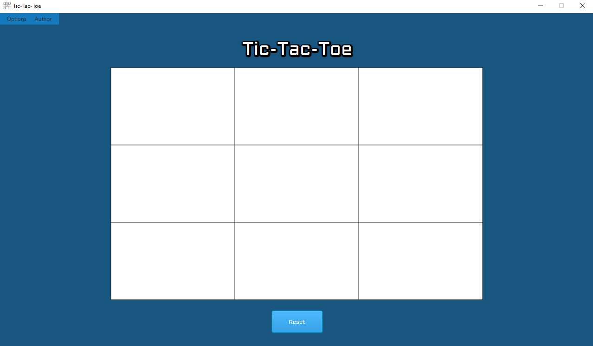
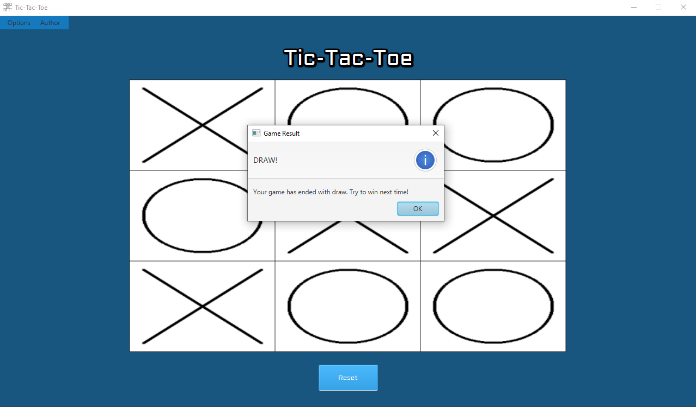

# Tic-Tac-Toe
Game of Tic-Tac-Toe made to play against computer. I implemented a minimax algorithm to let computer
make always the best move possible. Program made in Java with GUI made using JavaFX. Project is
based on Maven.

# Author
*[Szymon Półtorak](https://github.com/szymonpoltorak)*

# Technology Stack
* JDK 17.03 LTS,
* Apache Maven 3.8.1,
* Java FX 18.0.1,
* Css.

# ScreenShots
**Main Page**

**Example play**

